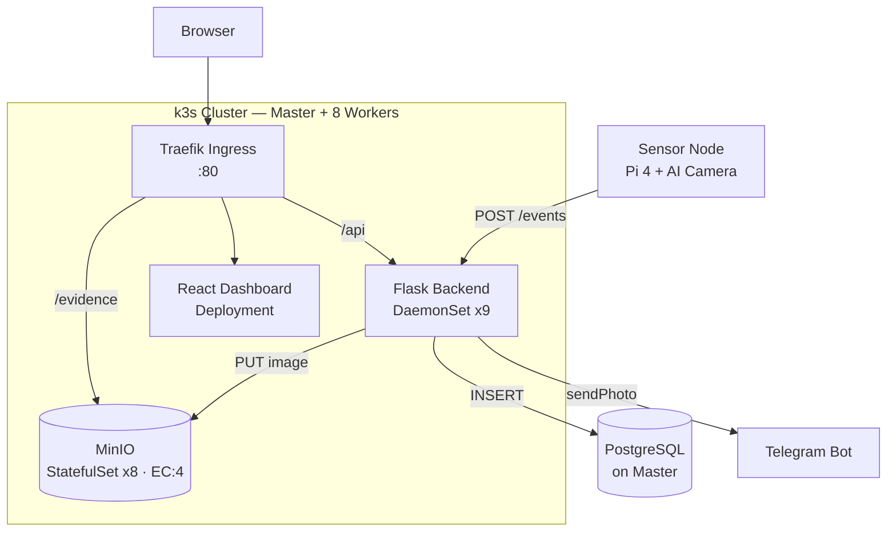
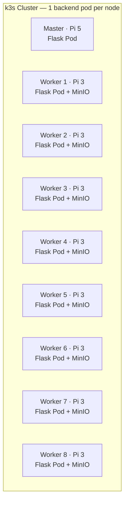
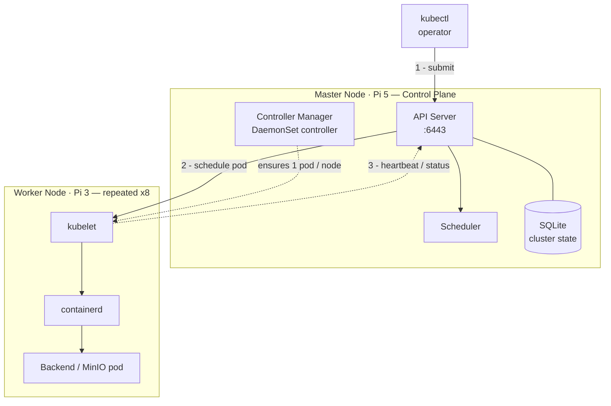
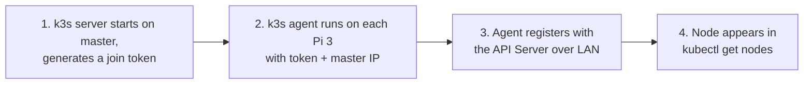
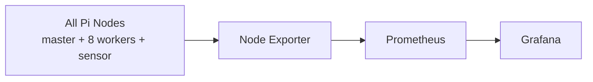
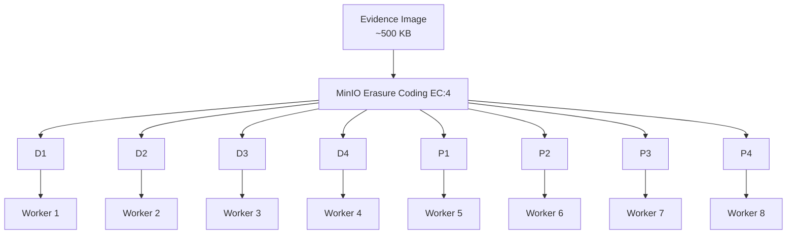

# Task 7 — Backend Deployment with Distributed Storage

## Overview

In this task, we deployed a distributed backend system on a Raspberry Pi cluster using Flask, PostgreSQL, MinIO, Docker, and k3s Kubernetes.

The backend receives AI detection events from the sensor node, stores event information, saves evidence images, and provides APIs for the frontend dashboard.

## Architecture



The sensor posts detections to the Flask backend, which writes to PostgreSQL and MinIO and pushes a Telegram alert. The React dashboard reads back through the same REST API behind Traefik.

## Technology Stack

| Component | Technology | Purpose |
|---|---|---|
| Backend | Flask (Python) | Provides REST API and handles detection events |
| Frontend | React | Displays dashboard, events, and camera information |
| Database | PostgreSQL | Stores event metadata |
| Object Storage | MinIO | Stores evidence images |
| Containerization | Docker | Packages application services |
| Cluster Management | k3s Kubernetes | Deploys and manages services |
| Monitoring | Prometheus + Grafana | Monitors node performance |

## System Workflow

### 1. Threat Detection

The AI camera continuously analyzes the video stream. When a threat is detected, detection info is generated, a snapshot is captured, and the event is sent to the backend.


### 2. Backend Processing

The Flask backend receives the detection event and performs event validation, metadata processing, image storage handling, database storage, and alert notification.

```python
@app.route("/events", methods=["POST"])
def receive_event():
    data = request.get_json()
    save_image(data["snapshot_b64"])
    event_store.store_event(data)
    return {"status": "ok"}, 201
```

## Data Storage

The system uses two different storage solutions.

### PostgreSQL

PostgreSQL stores structured event information: Event ID, Timestamp, Sensor ID, Threat Level, Confidence Score, Status, and Image Reference.

**Why PostgreSQL?**
- Efficient searching and filtering of events
- Supports multiple backend instances reading/writing at once
- Reliable structured data storage

```sql
CREATE TABLE events (
    id           BIGSERIAL PRIMARY KEY,
    received_at  TIMESTAMPTZ DEFAULT now(),
    sensor_id    TEXT,
    threat_level TEXT,
    confidence   DOUBLE PRECISION,
    image_key    TEXT,
    status       TEXT DEFAULT 'new'
);
```

### MinIO

MinIO stores the evidence images generated during detection, organized by date:

```
evidence/
 ├── 2026/07/14/143022_pi4-sensor.jpg
 ├── 2026/07/14/143205_pi4-sensor.jpg
 └── 2026/07/15/091143_pi4-sensor.jpg
```

**Why MinIO?**
- Designed for object storage
- Suitable for large image files
- Provides an S3-compatible storage API

```python
minio_client.put_object(
    bucket_name="evidence",
    object_name=image_key,
    data=image_bytes,
    content_type="image/jpeg"
)
```

## Kubernetes Deployment

The backend is deployed using a Kubernetes **DaemonSet**, which ensures one backend instance runs on **every** cluster node — the master and all 8 workers.



```yaml
apiVersion: apps/v1
kind: DaemonSet
metadata:
  name: backend
spec:
  selector:
    matchLabels: { app: backend }
  template:
    spec:
      containers:
        - name: backend
          image: sentinel-backend:latest
          ports:
            - containerPort: 8080
```

**Benefits:**
- High availability
- Automatic deployment
- Automatic restart of failed services
- Better resource distribution

## How k3s Clustering Actually Works



**Control plane (Master, Pi 5):**
- **API Server** — the single entry point every request goes through (`kubectl`, worker agents, everything)
- **Scheduler** — decides which node a new pod should run on
- **Controller Manager** — runs reconciliation loops, including the DaemonSet controller that keeps exactly one backend pod on every node
- **Embedded datastore** — k3s uses SQLite for a single-master setup like ours (full Kubernetes normally uses etcd; k3s swaps it for something lighter to fit the Pi's resources)

**Worker node (each Pi 3):**
- **kubelet** — the agent that talks to the API Server and starts/stops containers on that node
- **containerd** — the container runtime that actually runs the pods
- **kube-proxy** — routes network traffic to the right pod

**How a worker joins the cluster:**



**Why the backend ends up on all 9 nodes automatically:** the DaemonSet controller continuously watches cluster membership. Whenever a node joins — or a pod on it dies — the controller tells the scheduler "this node needs exactly one backend pod," and it happens without anyone redeploying anything by hand.

**What happens if a worker drops off:** it isn't removed from the cluster. Kubernetes marks it `NotReady` after a grace period and reschedules its pods elsewhere if needed; if the node reconnects, it resumes normally.

## Node Deployment

### Master Node (Raspberry Pi 5)
Runs: k3s control plane, PostgreSQL database, React frontend, Flask backend instance

### Worker Nodes (8 × Raspberry Pi 3)
Runs: Flask backend instance, MinIO storage service, Monitoring agent (Node Exporter)

## Monitoring System

The cluster is monitored using Node Exporter, Prometheus, and Grafana. **Node Exporter runs on every single node** — the master, all 8 workers, and the sensor Pi 4.



Collected metrics: CPU usage, RAM usage, Temperature, Network status, Node availability.

## Failure Handling — How Image Storage Survives Node Loss

MinIO splits every image using **erasure coding (EC:4)** before storing it — 4 data blocks + 4 parity blocks, one block per worker node.



| Workers offline | Reads | Writes | Data lost? |
|:---:|:---:|:---:|:---:|
| 0–3 | ✅ Working | ✅ Working | ❌ No |
| 4 | ✅ Working (any 4 of 8 blocks rebuild the image) | ❌ Blocked (needs 5-of-8 quorum) | ❌ No |
| 5+ | ❌ Blocked | ❌ Blocked | ❌ No — recovers automatically |

- **0–3 workers offline** — fully normal, everything works as usual.
- **4 workers offline — MinIO's hard limit.** Reads still succeed because any 4 of the 8 blocks reconstruct the original image. Writes stop, because MinIO requires agreement from at least 5 of the 8 nodes before it accepts new data.
- **5+ workers offline** — both reads and writes stop, but **nothing is deleted or corrupted**. The missing blocks are still on those Pi's SD cards; as soon as enough nodes reconnect, MinIO automatically re-syncs and rebuilds them.

On the backend side, if a worker node becomes unavailable, remaining Flask backend instances keep running (DaemonSet), and Kubernetes routes traffic only to healthy pods.

## Technology Decisions

### Why Flask?
- Lightweight and suitable for Raspberry Pi devices
- Python-based, integrates easily with AI applications
- Provides REST APIs for communication between components

### Why PostgreSQL?
- Event data requires structured storage
- Supports searching, filtering, and managing detection records
- Multiple backend instances can access the same database

### Why MinIO?
- The project mainly stores image evidence
- Object storage is more suitable for large files
- Provides an S3-compatible interface

### Why k3s?
- A lightweight Kubernetes distribution
- Designed for edge devices
- Manages containers efficiently across Raspberry Pi nodes

## Final System Provides

- AI-based threat detection
- Distributed backend deployment
- Persistent event storage
- Evidence image storage
- Web dashboard
- Cluster monitoring
- Automated service management using Kubernetes
