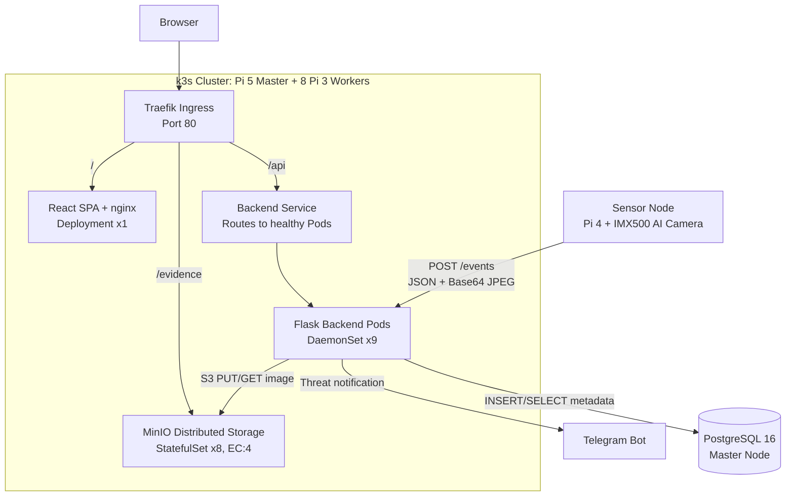
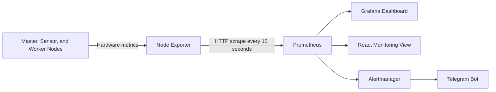

# Task 7 — Backend Deployment with Distributed Storage

## Overview

In this task, we deployed the backend of the threat-detection system on a **9-node k3s Raspberry Pi cluster**.

The implementation uses:

- **Flask** for the REST API
- **PostgreSQL** for event metadata and shared application settings
- **MinIO** for distributed evidence-image storage
- **k3s** for workload deployment and service routing
- **Docker/OCI images** for packaging the backend and frontend

The **Pi 4 sensor with the IMX500 AI camera is outside the k3s cluster**. It performs AI inference and sends detection events to the cluster backend.

---

## Architecture



---

## Technology Stack

| Component | Technology | Purpose |
|---|---|---|
| AI sensor | Pi 4 + IMX500 camera | Runs detection and sends events |
| Backend | Flask (Python) | Receives events and provides REST APIs |
| Database | PostgreSQL | Stores searchable event metadata and shared settings |
| Object storage | MinIO | Stores evidence images across worker nodes |
| Frontend | React + nginx | Displays events, images, and system information |
| Cluster platform | k3s | Manages Pods, Services, StatefulSets, and ingress |
| Image packaging | Docker/OCI images | Packages backend, frontend, and MinIO software |
| Container runtime | k3s containerd | Runs the container images inside Kubernetes Pods |

> Docker is used to build and push the images to the local registry. Inside k3s, the images are run by the bundled **containerd** runtime.

---

## System Workflow

### 1. Threat Detection

The IMX500 camera performs AI inference on the sensor node. When an object passes the configured confidence threshold, the sensor creates an event containing:

- Sensor ID and location
- Threat level
- Detected object classes
- Confidence scores
- Bounding boxes
- JPEG snapshot encoded as Base64

The sensor sends this data to:

```text
POST http://192.168.137.10:8080/events
```

The network request runs in a background thread, so a slow connection does not stop the live camera stream.

### 2. Backend Processing

The Flask backend receives the event and:

1. Checks the cluster-wide detection on/off setting.
2. Decodes the Base64 snapshot into JPEG data.
3. Uploads the evidence image to MinIO.
4. Inserts the event metadata into PostgreSQL.
5. Starts the Telegram notification asynchronously.
6. Provides the stored event through its REST API.

### 3. Dashboard Access

The React frontend does not connect directly to PostgreSQL.

It requests event records from Flask:

```text
GET /api/events
GET /api/events/{id}
POST /api/events/{id}/status
```

Flask reads the metadata from PostgreSQL and returns the image URL. The browser loads the corresponding evidence image from MinIO through the `/evidence` ingress route.

---

## PostgreSQL Storage

PostgreSQL stores the structured and searchable part of each event.

### `events` table

The code stores:

```text
id
received_at
sensor_id
location
threat_level
detections (JSONB)
confidence
image_key
image_url
status
```

The `status` field supports the event workflow:

```text
new → acknowledged → resolved
```

This allows the dashboard to search, sort, filter, update, and delete event records efficiently.

### `app_settings` table

PostgreSQL also stores the shared detection setting.

This is important because all nine Flask replicas must use the same detection state. If the setting were kept only in memory, each Pod could have a different value after a restart or dashboard update.

---

## MinIO Distributed Image Storage

MinIO stores the evidence images as S3-compatible objects in the `evidence` bucket.

It is deployed as an **8-replica StatefulSet**, with one MinIO Pod and one persistent volume on each worker node.

### Example: How One Image Is Distributed

Suppose Flask uploads:

```text
fire-detection.jpg
```

With the configured **EC:4** storage class, MinIO creates four data shards and four parity shards:

```text
                         fire-detection.jpg
                                  |
             ---------------------------------------------
             |      |      |      |      |      |      |      |
             D1     D2     D3     D4     P1     P2     P3     P4
             |      |      |      |      |      |      |      |
          Worker1 Worker2 Worker3 Worker4 Worker5 Worker6 Worker7 Worker8
```

- **Data shards** contain encoded portions of the original image.
- **Parity shards** contain recovery information generated through erasure coding.
- A parity shard does not correspond to only one specific data shard. MinIO combines the available shards to reconstruct missing data.

### Expected Storage Availability

| Workers offline | Read existing images | Write new images |
|:---:|:---:|:---:|
| 0–3 | Yes | Yes |
| 4 | Yes | No |
| 5 or more | No | No |

With four workers offline, MinIO still has the minimum number of shards required to reconstruct an existing image, but it does not have the write quorum required to safely store a new image.

When offline workers return, the existing data on their persistent storage becomes available again, and MinIO can heal missing or outdated shards. A temporary node outage affects **availability**, but does not automatically mean that stored data has been deleted.

---

## Kubernetes Deployment

### Backend DaemonSet

The Flask backend is deployed as a Kubernetes **DaemonSet**.

A DaemonSet ensures that one backend Pod runs on every eligible cluster node:

```text
Pi 5 Master   → Backend Pod
Worker 1      → Backend Pod
Worker 2      → Backend Pod
...
Worker 8      → Backend Pod
```

The hierarchy is:

```text
DaemonSet → Pod → Container → Flask application
```

The DaemonSet creates and maintains the Pods. It does **not** load-balance network traffic.

### Backend Service

The Kubernetes **Service** selects the backend Pods using the `app: backend` label and provides a stable in-cluster endpoint.

For browser API requests, the flow is:

```text
Browser → Traefik → Backend Service → Healthy Flask Pod
```

If a worker node goes offline:

- The backend Pod on that node becomes unavailable.
- The DaemonSet does not move an additional copy to another node.
- The Service continues routing API requests to the remaining healthy Pods.
- When the node returns, the DaemonSet ensures that its backend Pod is running again.

### Health Checks

Every backend Pod exposes:

```text
GET /health
```

Kubernetes uses this endpoint for readiness and liveness probes. A Pod that is not ready is removed from Service traffic, while an unhealthy container can be restarted automatically.

### MinIO StatefulSet

MinIO uses a StatefulSet instead of a DaemonSet because storage Pods require:

- Stable Pod identities such as `minio-0` to `minio-7`
- PersistentVolumeClaims
- One storage Pod per worker
- Predictable communication between MinIO members

Pod anti-affinity prevents two MinIO replicas from being placed on the same worker node.

---

## Node Deployment

### Master Node — Raspberry Pi 5

The master runs:

- k3s control plane
- Traefik ingress
- PostgreSQL in Docker Compose
- One Flask backend Pod
- React/nginx frontend Pod
- Local container image registry

### Worker Nodes — 8 × Raspberry Pi 3

Each worker runs:

- k3s agent
- One Flask backend Pod
- One MinIO storage Pod
- One persistent MinIO volume
- Node Exporter as a system service

---

## Monitoring Integration

Monitoring is separate from Flask event processing.



- **Node Exporter** reads CPU, memory, disk, temperature, and operating-system metrics.
- **Prometheus** scrapes and stores the metrics every 15 seconds.
- **Grafana** visualizes Prometheus data in a separate dashboard.
- The **React monitoring pages also query the Prometheus HTTP API directly**.
- **Alertmanager** sends alerts when configured Prometheus rules fire.

A separate cluster-topology service checks Kubernetes node state every 30 seconds and sends Telegram messages when a node changes between online and offline.

---

## Failure Handling

| Failure | System behaviour |
|---|---|
| One backend worker fails | API requests continue through the remaining healthy backend Pods |
| Backend container fails | Kubernetes can restart it after the liveness probe fails |
| Worker returns | DaemonSet ensures the backend Pod runs again |
| Up to 3 MinIO workers fail | Existing images and new image writes remain available |
| Exactly 4 MinIO workers fail | Existing images remain readable, but new writes stop |
| 5+ MinIO workers fail | Image reads and writes pause until enough workers return |

> **Current limitation:** The sensor posts directly to the master node's `hostPort 8080`, and PostgreSQL, Traefik, the frontend, and the k3s control plane also run on the master. Therefore, the master node remains a single point of failure in the current architecture.

---

## Why These Technologies?

### Why Flask?

- Lightweight enough for Pi 3 worker nodes
- Requires only a small Python dependency set
- Provides simple REST endpoints
- Application-critical shared state is stored in PostgreSQL and MinIO, so any healthy replica can serve the REST API

The AI model does not run inside Flask. Inference runs on the IMX500 sensor, while Flask receives and manages the resulting events. Each backend Pod also keeps non-critical local snapshots and JSON audit logs, but the shared dashboard API relies on PostgreSQL and MinIO.

### Why PostgreSQL?

- Supports concurrent access from all backend replicas
- Provides indexed queries for dashboard filtering and sorting
- Supports JSONB for variable detection lists and bounding boxes
- Stores the shared cluster-wide detection setting

### Why MinIO?

- Provides an S3-compatible object-storage API
- Stores evidence images separately from searchable database records
- Supports distributed erasure-coded storage across the eight workers
- Fits the limited resources of Raspberry Pi worker nodes

### Why k3s?

- Lightweight Kubernetes distribution suitable for ARM edge devices
- Supports DaemonSets, StatefulSets, Services, health probes, and ingress
- Automatically manages the desired workload state across cluster nodes

---

## Final Result

The completed Task 7 system provides:

- A Flask REST backend running across all nine k3s nodes
- Shared event metadata in PostgreSQL
- Distributed evidence-image storage in MinIO
- REST APIs used by the React dashboard
- Service routing to healthy backend Pods
- Persistent storage and erasure-coded image recovery
- Health checks and automatic container restart
- Integration with monitoring and Telegram notifications
