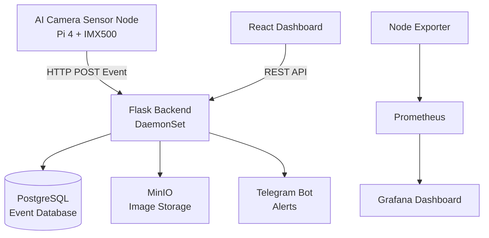
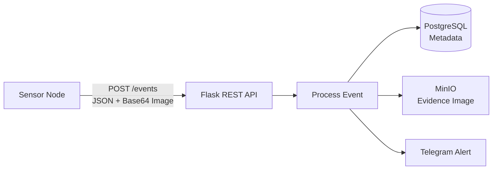
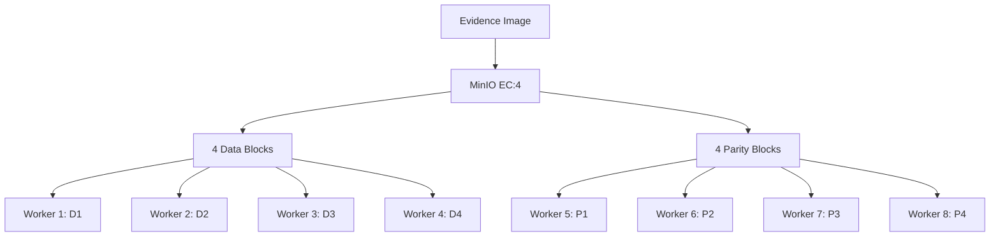
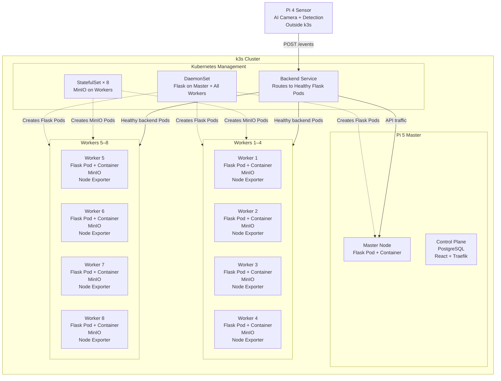
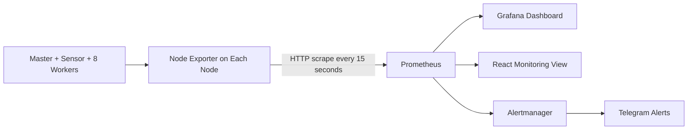

# Task 7 — Backend Deployment with Distributed Storage

## Overview

In this task, we deployed a distributed backend system on a Raspberry Pi cluster using **Flask, PostgreSQL, MinIO, Docker, and k3s Kubernetes**.

The backend receives AI detection events from the sensor node, stores event information, saves evidence images, and provides APIs for the frontend dashboard.

---

# Architecture



---

# Technology Stack

| Component | Technology | Purpose |
|---|---|---|
| AI Sensor | Pi 4 + IMX500 camera | Runs the AI model and generates detection events |
| Backend | Flask (Python) | Provides REST APIs and handles detection events |
| Frontend | React | Displays the dashboard, events, images, and camera information |
| Database | PostgreSQL | Stores structured and searchable event metadata |
| Object Storage | MinIO | Stores evidence images across the worker nodes |
| Containerization | Docker | Packages the backend and frontend with their dependencies |
| Cluster Management | k3s Kubernetes | Deploys and manages application Pods across the cluster |
| Ingress | Traefik | Routes browser requests to the frontend, backend, and image storage |
| Monitoring | Node Exporter + Prometheus + Grafana | Collects, stores, and visualizes node metrics |
| Availability Checks | Blackbox Exporter + Alertmanager | Checks reachability and sends infrastructure alerts |

---

# System Workflow

## 1. Threat Detection

The IMX500 AI camera continuously analyzes the video stream using the deployed `network.rpk` model. OpenCV draws the detection boxes and converts the selected frame into a JPEG snapshot.

When a detected object passes the confidence threshold:

- Detection information is generated.
- A JPEG snapshot is captured and encoded as Base64.
- The event is sent to the Flask backend using an HTTP `POST` request.


A shortened version of the sensor-side REST communication is shown below. The event is sent to the Flask backend using an HTTP POST request:

```python
requests.post(API_URL, json=event, timeout=3)
```

The sensor sends the detection event to Flask using HTTP POST.

```python
# Sensor node: sensor/detect_stream.py

event = {
    "sensor_id": SENSOR_ID,
    "location": LOCATION,
    "detections": detections,
    "threat_level": threat_level(labels_seen),
    "snapshot_b64": snapshot_b64,
}

# Send detection event and image to the Flask backend
requests.post(
    "http://<master-node-ip>:8080/events",
    json=event,
    timeout=3
)
```

Flask receives the event at `/events` and stores it.

```python
# Master node: master/server/server.py

from flask import Flask, request, jsonify

app = Flask(__name__)

@app.route("/events", methods=["POST"])
def receive_event():
    event = request.get_json()

    sensor_id = event["sensor_id"]
    threat_level = event["threat_level"]
    detections = event["detections"]
    snapshot_b64 = event["snapshot_b64"]

    store_event(event)

    return jsonify({"status": "stored"}), 201
```

---

## 2. Backend Processing

The sensor sends the detection event to the Flask `/events` endpoint. Flask checks whether detection is enabled and then passes the event to the storage layer.



A simplified version of the Flask endpoint is shown below:

```python
# master/server/server.py

@app.route("/events", methods=["POST"])
def receive_event():
    data = request.get_json()

    if not event_store.is_detection_enabled():
        return jsonify({"status": "ignored"}), 200

    event_store.store_event(data)

    return jsonify({"status": "received"}), 200
```

The `store_event()` function stores the event metadata in PostgreSQL, uploads the evidence image to MinIO, and triggers the Telegram notification.

### Frontend Communication

The React dashboard communicates with Flask through REST endpoints:

```text
GET  /api/events
GET  /api/events/{id}
POST /api/events/{id}/status
GET  /api/detection
POST /api/detection
```

React does not connect directly to PostgreSQL or MinIO. It sends requests to Flask, and Flask reads or updates the stored data.

---

# Data Storage

The system uses two different storage solutions because metadata and image files have different requirements.

## PostgreSQL

PostgreSQL stores the structured and searchable information for each detection event.

Stored metadata includes:

- Event ID and timestamp
- Sensor ID and location
- Threat level
- Detected objects and confidence scores
- Event status
- Reference to the image stored in MinIO

A simplified version of the event table is shown below:

```sql
CREATE TABLE events (
    id           BIGSERIAL PRIMARY KEY,
    received_at  TIMESTAMPTZ DEFAULT now(),
    sensor_id    TEXT,
    location     TEXT,
    threat_level TEXT,
    detections   JSONB,
    confidence   DOUBLE PRECISION,
    image_key    TEXT,
    status       TEXT DEFAULT 'new'
);
```

Flask stores the event metadata after the evidence image has been uploaded to MinIO:

```python
cur.execute(
    """
    INSERT INTO events
        (sensor_id, location, threat_level, detections,
         confidence, image_key)
    VALUES (%s, %s, %s, %s, %s, %s)
    """,
    (
        sensor_id,
        location,
        threat_level,
        Json(detections),
        confidence,
        image_key,
    ),
)
```

The event status supports the following workflow:

```text
new → acknowledged → resolved
```

### Why PostgreSQL?

- Supports fast searching, sorting, and filtering
- Allows all Flask backend instances to access the same data
- Uses JSONB for flexible detection results
- Stores the shared detection on/off setting

---

## MinIO

MinIO stores the evidence images generated during threat detection.

Example object structure:

```text
evidence/
├── 2026/07/15/event001.jpg
├── 2026/07/15/event002.jpg
└── 2026/07/15/event003.jpg
```

Flask uploads each decoded image through the MinIO S3-compatible API:

```python
_minio().put_object(
    MINIO_BUCKET,
    image_key,
    io.BytesIO(image_bytes),
    length=len(image_bytes),
    content_type="image/jpeg",
)
```

### Why MinIO?

- Designed for image and object storage
- Provides an S3-compatible API
- Supports distributed storage across the worker nodes
- Keeps images available when some workers fail

---

### Distributed Image Storage

MinIO runs as an **8-replica StatefulSet**, with one storage Pod on each Pi 3 worker.

Using **EC:4 erasure coding**, every image is divided into:

- 4 data blocks containing the image information
- 4 parity blocks containing recovery information



The worker-to-block mapping is only an illustration. MinIO manages the actual block placement internally.

Parity blocks do not replace one specific data block. MinIO combines the available data and parity blocks to reconstruct the original image.

The relevant configuration is:

```yaml
kind: StatefulSet

spec:
  replicas: 8

  template:
    spec:
      containers:
        - name: minio
          env:
            - name: MINIO_STORAGE_CLASS_STANDARD
              value: "EC:4"
```

### Storage Availability

| Workers offline | Read existing images | Store new images |
|:---:|:---:|:---:|
| 0–3 | Yes | Yes |
| 4 | Yes | No |
| 5 or more | No | No |

With four workers offline, MinIO still has enough blocks to reconstruct existing images, but it does not have the required write quorum for new images.

When the workers return, MinIO uses the stored blocks to restore and synchronize the distributed data.

---

# Kubernetes Deployment and Node Placement

The application runs on a **k3s cluster** consisting of one Raspberry Pi 5 master and eight Raspberry Pi 3 workers. The Pi 4 sensor node remains outside the cluster and sends detection events to the Flask backend over HTTP.




The Flask backend is first packaged as a Docker image. k3s then runs the image as a container inside a Kubernetes Pod.

```text
Docker Image → Container → Pod → DaemonSet → k3s Cluster
```

A Kubernetes **DaemonSet** ensures that one Flask backend Pod runs on every available cluster node.

A **Service** provides a stable backend endpoint and routes requests to healthy Flask Pods.

A shortened version of the deployment configuration is shown below:

```yaml
apiVersion: v1
kind: Service
metadata:
  name: backend
spec:
  selector:
    app: backend
  ports:
    - port: 8080
      targetPort: 8080

---
apiVersion: apps/v1
kind: DaemonSet
metadata:
  name: backend
spec:
  selector:
    matchLabels:
      app: backend

  template:
    metadata:
      labels:
        app: backend

    spec:
      containers:
        - name: backend
          image: 192.168.137.10:5000/sentinel-backend:latest

          ports:
            - containerPort: 8080

          readinessProbe:
            httpGet:
              path: /health
              port: 8080
```

### How It Works

- **Docker** packages Flask, Python, and the required libraries.
- **DaemonSet** creates one backend Pod on every available k3s node.
- **Service** routes API requests to healthy backend Pods.
- **Traefik** routes browser requests such as `/api` to the backend Service.
- **Health probes** check `/health` and prevent unhealthy Pods from receiving traffic.

If a worker node disconnects, its backend Pod becomes unavailable, but the Kubernetes Service continues routing requests to the remaining healthy Pods. When the node returns, the DaemonSet ensures that the backend Pod is running again.

---

# Monitoring System

The monitoring system is separate from Flask event processing. Node Exporter runs on the master, sensor, and worker nodes and exposes hardware metrics on port `9100`.

Prometheus uses a pull-based model and collects the latest metrics every **15 seconds**. Blackbox Exporter separately checks ping and HTTP reachability for nodes and the camera service.



The configured collection interval is:

```yaml
global:
  scrape_interval: 15s
  evaluation_interval: 15s
```

Collected metrics include:

- CPU usage and system load
- RAM usage
- Device temperature
- Disk and storage usage
- Network and node availability
- System uptime

The communication flow is:

```text
Node Exporter exposes metrics → Prometheus collects and stores them
Prometheus data → Grafana and React display the latest values
Prometheus alert rule → Alertmanager → Telegram notification
```

Grafana visualizes the Prometheus time-series data. The React monitoring pages also read the Prometheus HTTP API, which is why the values on the dashboard update as new 15-second samples become available.

---

# Failure Handling

If a worker node becomes unavailable:

- Its Flask Pod and MinIO block become temporarily unavailable.
- The Kubernetes Service continues routing API requests to the remaining healthy Flask Pods.
- The DaemonSet does not move a second Flask copy to another node because its rule is one Pod per node.
- When the worker reconnects, the DaemonSet ensures that its Flask Pod runs again.
- MinIO continues according to the available read and write quorum shown above.

> **Current limitation:** The Pi 5 master runs the k3s control plane, PostgreSQL, Traefik, and the frontend. It is therefore a single point of failure in the current implementation.

---

# Technology Decisions

## Why Flask?

Flask was selected because:

- It is lightweight and suitable for Raspberry Pi devices.
- It is Python-based and fits naturally with the Python sensor application.
- It provides simple REST APIs for communication between the sensor, storage, and frontend.
- The backend is stateless because shared data is stored in PostgreSQL and MinIO.

The AI model is not executed by Flask. The IMX500 camera performs the inference, and Flask receives and manages the detection result.

---

## Why PostgreSQL?

PostgreSQL was selected because:

- Event data requires structured and searchable storage.
- It supports filtering, sorting, and managing detection records.
- Multiple Flask backend instances can access the database at the same time.
- `JSONB` supports flexible detection data without creating a separate table for every detected object.

---

## Why MinIO?

MinIO was selected because:

- The project mainly stores image evidence.
- Object storage is more suitable for image files than a relational database.
- It provides an S3-compatible interface.
- Erasure coding distributes images across the eight workers and provides fault tolerance.

---

## Why k3s?

k3s was selected because:

- It is a lightweight Kubernetes distribution.
- It is suitable for ARM-based edge devices.
- It manages Pods and Services across the Raspberry Pi cluster.
- It supports DaemonSets, StatefulSets, health checks, and Traefik ingress.

---

# Final System Provides

- AI-based threat detection
- Flask REST API communication
- Distributed backend deployment
- Persistent PostgreSQL event storage
- Distributed MinIO evidence-image storage
- Web dashboard and event workflow
- Cluster monitoring with 15-second metric collection
- Telegram threat and infrastructure alerts
- Automated service management using Kubernetes
