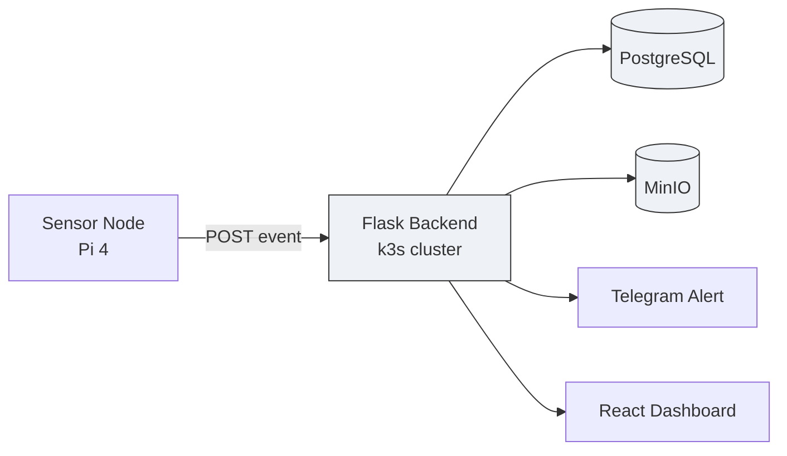
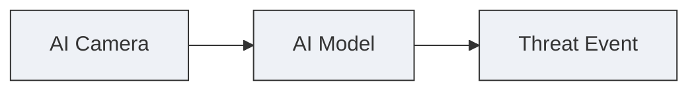
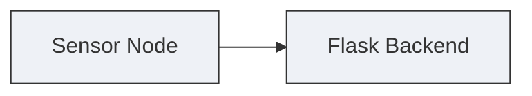
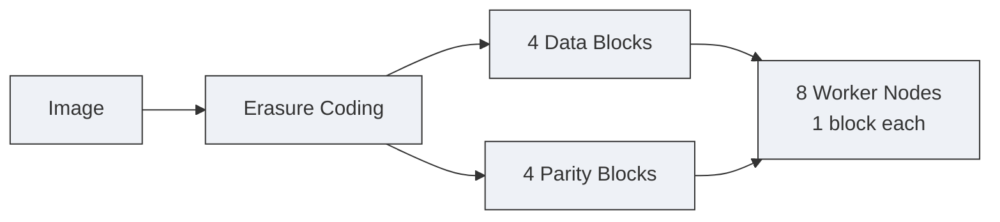
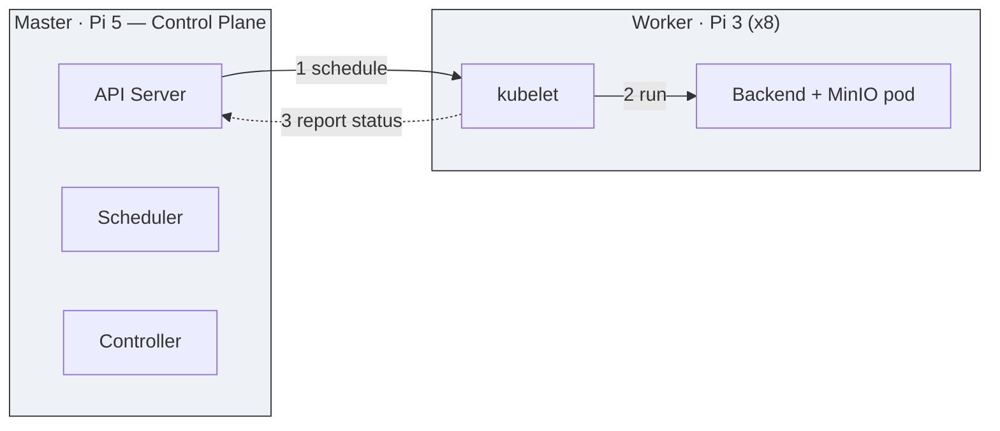

# Task 7 — Backend Deployment with Distributed Storage

## Overview

In this task, we deployed a distributed backend system on a Raspberry Pi cluster using Flask, PostgreSQL, MinIO, Docker, and k3s Kubernetes.

The backend receives AI detection events from the sensor node, stores event information, saves evidence images, and provides APIs for the frontend dashboard.

## Architecture



One sentence version: the sensor sends a detection to the backend, the backend saves it (Postgres + MinIO), alerts Telegram, and the dashboard reads it back.

## Tech Stack

| Component | Technology | Purpose |
|---|---|---|
| Backend | Flask (Python) | REST API, handles detection events |
| Frontend | React | Dashboard for events and camera |
| Database | PostgreSQL | Event metadata |
| Object Storage | MinIO | Evidence images |
| Containerization | Docker | Packages the services |
| Cluster | k3s Kubernetes | Deploys and manages everything |
| Monitoring | Prometheus + Grafana | Node health |

## System Workflow

### 1. Threat Detection

The AI camera continuously analyzes the video stream. When a threat is detected: detection info is generated, a snapshot is captured, and the event is sent to the backend.



### 2. Backend Processing

The Flask backend receives the event and performs: event validation, metadata processing, image storage handling, database storage, alert notification.



```python
@app.route("/events", methods=["POST"])
def receive_event():
    data = request.get_json()
    save_image(data["snapshot_b64"])
    event_store.store_event(data)
    return {"status": "ok"}, 201
```

### 3. Data Storage

PostgreSQL stores the structured event record: Event ID, Timestamp, Sensor ID, Threat Level, Confidence Score, Status, Image Reference.

**Why PostgreSQL?**
- Fast searching/filtering of past events
- Multiple backend replicas can read/write it at once
- Reliable, structured, battle-tested

```sql
CREATE TABLE events (
    id           BIGSERIAL PRIMARY KEY,
    received_at  TIMESTAMPTZ DEFAULT now(),
    sensor_id    TEXT,
    threat_level TEXT,
    confidence   DOUBLE PRECISION,
    image_key    TEXT,
    status       TEXT DEFAULT 'new'
);
```

**Also handled here:**
- Each event moves through a simple status workflow: `new → acknowledged → resolved`
- Old events beyond a retention limit are automatically pruned, so storage never grows unbounded

### 4. MinIO — Evidence Image Storage

Images aren't just copied to one Pi — MinIO splits each image using **erasure coding (EC:4)**: 4 data blocks + 4 parity blocks, spread across the 8 worker nodes, one block per worker.



This means up to **4 of the 8 workers can go offline and no data is lost** — any 4 blocks are enough to rebuild the original image.

```python
minio_client.put_object(
    bucket_name="evidence",
    object_name=image_key,     # e.g. 2026/07/14/143022_pi4.jpg
    data=image_bytes
)
```

### 5. Kubernetes Deployment — How the Cluster Works

The whole system runs on **k3s** (lightweight Kubernetes) across 9 nodes: 1 master (Pi 5) + 8 workers (Pi 3).



**Master (control plane) — the "brain":**
- **API Server** — every request (from `kubectl`, from workers) goes through here first
- **Scheduler** — decides which node a pod should run on
- **Controller Manager** — keeps the cluster in the state it's supposed to be in (see DaemonSet below)

**Worker nodes — the "hands":**
- **kubelet** — the agent on each Pi 3 that takes orders from the API Server
- It starts the actual pod (Backend or MinIO) and reports back "I'm healthy" every few seconds

**How a worker joins:** master generates a join token → each Pi 3 runs the k3s agent with that token → it registers itself with the API Server → it shows up in `kubectl get nodes` and can now receive pods.

**Why the backend runs on all 9 nodes:** it's deployed as a **DaemonSet** — a Kubernetes object that tells the Controller "always keep exactly one backend pod on every node." If a new node joins, or a pod crashes, the controller fixes it automatically — no manual redeploy.

```yaml
kind: DaemonSet
spec:
  template:
    spec:
      containers:
        - name: backend
          image: sentinel-backend:latest
```

**If a worker goes offline:** Kubernetes marks it `NotReady` after a short grace period and keeps routing traffic to the healthy nodes. When it comes back, it rejoins automatically.

### 6. Why Flask + Why MinIO (short version)

- **Flask** — lightweight enough for a 1 GB Pi 3, Python-based, simple REST API, no heavy framework overhead
- **MinIO** — S3-compatible object storage, built for images/files, and its erasure coding is what gives us node-failure tolerance for free

## Final System Provides

- AI-based threat detection
- Distributed backend deployment (k3s DaemonSet)
- Persistent event storage (PostgreSQL)
- Fault-tolerant evidence image storage (MinIO, EC:4)
- Web dashboard
- Cluster monitoring (Prometheus + Grafana)
