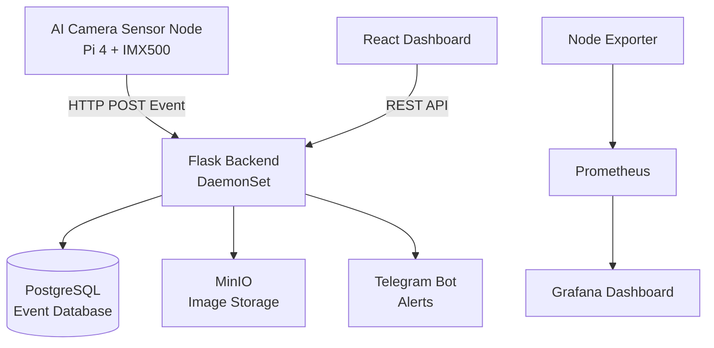
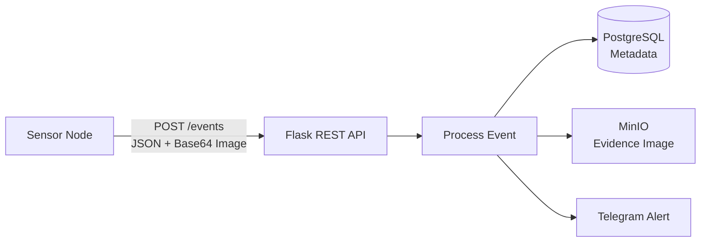
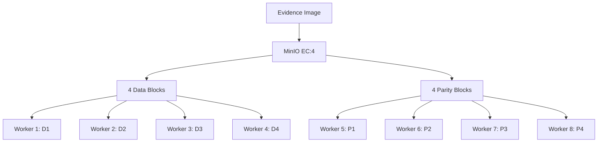
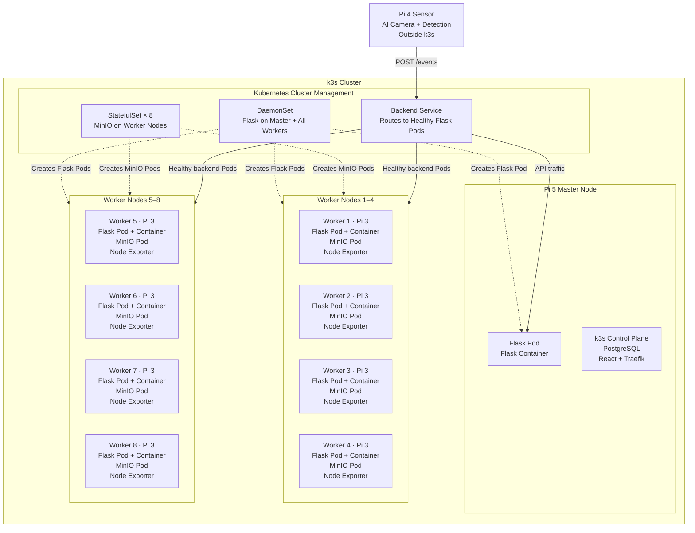
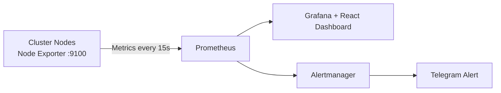
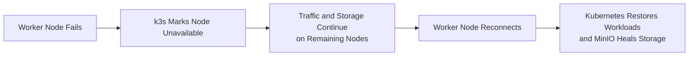
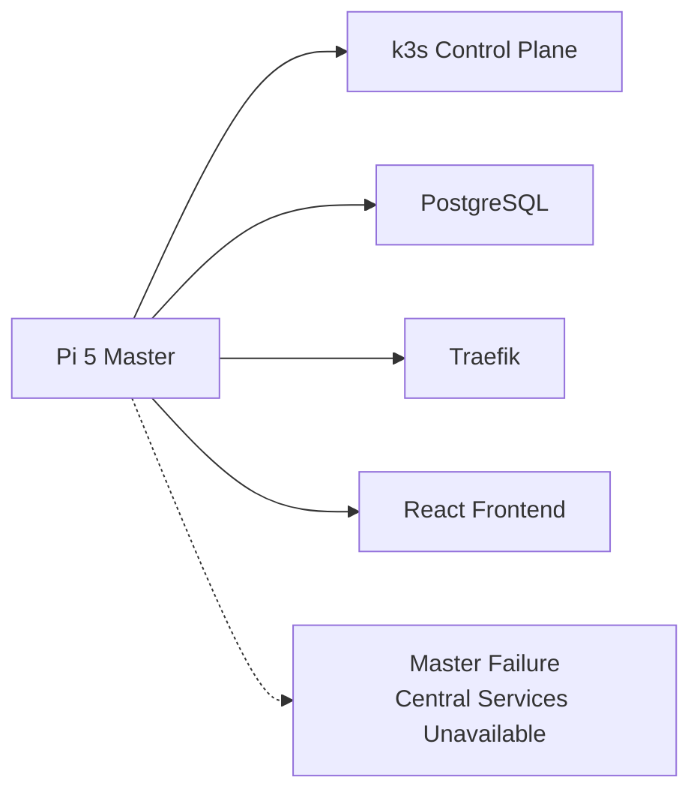

# Task 7 — Backend Deployment with Distributed Storage

## Overview

In this task, we deployed a distributed backend system on a Raspberry Pi cluster using **Flask, PostgreSQL, MinIO, Docker, and k3s Kubernetes**.

The backend receives AI detection events from the sensor node, stores event information, saves evidence images, and provides APIs for the frontend dashboard.

---

# Architecture



---

# Technology Stack

| Component | Technology | Purpose |
|---|---|---|
| AI Sensor | Pi 4 + IMX500 camera | Runs the AI model and generates detection events |
| Backend | Flask (Python) | Provides REST APIs and handles detection events |
| Frontend | React | Displays the dashboard, events, images, and camera information |
| Database | PostgreSQL | Stores structured and searchable event metadata |
| Object Storage | MinIO | Stores evidence images across the worker nodes |
| Containerization | Docker | Packages the backend and frontend with their dependencies |
| Cluster Management | k3s Kubernetes | Deploys and manages application Pods across the cluster |
| Ingress | Traefik | Routes browser requests to the frontend, backend, and image storage |
| Monitoring | Node Exporter + Prometheus + Grafana | Collects, stores, and visualizes node metrics |
| Availability Checks | Blackbox Exporter + Alertmanager | Checks reachability and sends infrastructure alerts |

---

# System Workflow

## 1. Threat Detection

The IMX500 AI camera continuously analyzes the video stream using the deployed `network.rpk` model. OpenCV draws the detection boxes and converts the selected frame into a JPEG snapshot.

When a detected object passes the confidence threshold:

- Detection information is generated.
- A JPEG snapshot is captured and encoded as Base64.
- The event is sent to the Flask backend using an HTTP `POST` request.


A shortened version of the sensor-side REST communication is shown below. The event is sent to the Flask backend using an HTTP POST request:

```python
requests.post(API_URL, json=event, timeout=3)
```

The sensor sends the detection event to Flask using HTTP POST.

```python
# Sensor node: sensor/detect_stream.py

event = {
    "sensor_id": SENSOR_ID,
    "location": LOCATION,
    "detections": detections,
    "threat_level": threat_level(labels_seen),
    "snapshot_b64": snapshot_b64,
}

# Send detection event and image to the Flask backend
requests.post(
    "http://<master-node-ip>:8080/events",
    json=event,
    timeout=3
)
```

Flask receives the event at `/events` and stores it.

```python
# Master node: master/server/server.py

from flask import Flask, request, jsonify

app = Flask(__name__)

@app.route("/events", methods=["POST"])
def receive_event():
    event = request.get_json()

    sensor_id = event["sensor_id"]
    threat_level = event["threat_level"]
    detections = event["detections"]
    snapshot_b64 = event["snapshot_b64"]

    store_event(event)

    return jsonify({"status": "stored"}), 201
```

---

## 2. Backend Processing

The sensor sends the detection event to the Flask `/events` endpoint. Flask checks whether detection is enabled and then passes the event to the storage layer.



A simplified version of the Flask endpoint is shown below:

```python
# master/server/server.py

@app.route("/events", methods=["POST"])
def receive_event():
    data = request.get_json()

    if not event_store.is_detection_enabled():
        return jsonify({"status": "ignored"}), 200

    event_store.store_event(data)

    return jsonify({"status": "received"}), 200
```

The `store_event()` function stores the event metadata in PostgreSQL, uploads the evidence image to MinIO, and triggers the Telegram notification.

### Frontend Communication

The React dashboard communicates with Flask through REST endpoints:

```text
GET  /api/events
GET  /api/events/{id}
POST /api/events/{id}/status
GET  /api/detection
POST /api/detection
```

React does not connect directly to PostgreSQL or MinIO. It sends requests to Flask, and Flask reads or updates the stored data.

---

# Data Storage

The system uses two different storage solutions because metadata and image files have different requirements.

## PostgreSQL

PostgreSQL stores the structured and searchable information for each detection event.

Stored metadata includes:

- Event ID and timestamp
- Sensor ID and location
- Threat level
- Detected objects and confidence scores
- Event status
- Reference to the image stored in MinIO

A simplified version of the event table is shown below:

```sql
CREATE TABLE events (
    id           BIGSERIAL PRIMARY KEY,
    received_at  TIMESTAMPTZ DEFAULT now(),
    sensor_id    TEXT,
    location     TEXT,
    threat_level TEXT,
    detections   JSONB,
    confidence   DOUBLE PRECISION,
    image_key    TEXT,
    status       TEXT DEFAULT 'new'
);
```

Flask stores the event metadata after the evidence image has been uploaded to MinIO:

```python
cur.execute(
    """
    INSERT INTO events
        (sensor_id, location, threat_level, detections,
         confidence, image_key)
    VALUES (%s, %s, %s, %s, %s, %s)
    """,
    (
        sensor_id,
        location,
        threat_level,
        Json(detections),
        confidence,
        image_key,
    ),
)
```

The event status supports the following workflow:

```text
new → acknowledged → resolved
```

### Why PostgreSQL?

- Supports fast searching, sorting, and filtering
- Allows all Flask backend instances to access the same data
- Uses JSONB for flexible detection results
- Stores the shared detection on/off setting

---

## MinIO

MinIO stores the evidence images generated during threat detection.

Example object structure:

```text
evidence/
├── 2026/07/15/event001.jpg
├── 2026/07/15/event002.jpg
└── 2026/07/15/event003.jpg
```

Flask uploads each decoded image through the MinIO S3-compatible API:

```python
_minio().put_object(
    MINIO_BUCKET,
    image_key,
    io.BytesIO(image_bytes),
    length=len(image_bytes),
    content_type="image/jpeg",
)
```

### Why MinIO?

- Designed for image and object storage
- Provides an S3-compatible API
- Supports distributed storage across the worker nodes
- Keeps images available when some workers fail

---

### Distributed Image Storage

MinIO runs as an **8-replica StatefulSet**, with one storage Pod on each Pi 3 worker.

Using **EC:4 erasure coding**, every image is divided into:

- 4 data blocks containing the image information
- 4 parity blocks containing recovery information



The worker-to-block mapping is only an illustration. MinIO manages the actual block placement internally.

Parity blocks do not replace one specific data block. MinIO combines the available data and parity blocks to reconstruct the original image.

The relevant configuration is:

```yaml
kind: StatefulSet

spec:
  replicas: 8

  template:
    spec:
      containers:
        - name: minio
          env:
            - name: MINIO_STORAGE_CLASS_STANDARD
              value: "EC:4"
```

### Storage Availability

| Workers offline | Read existing images | Store new images |
|:---:|:---:|:---:|
| 0–3 | Yes | Yes |
| 4 | Yes | No |
| 5 or more | No | No |

With four workers offline, MinIO still has enough blocks to reconstruct existing images, but it does not have the required write quorum for new images.

When the workers return, MinIO uses the stored blocks to restore and synchronize the distributed data.

---

# Kubernetes Deployment, Clustering, and Node Placement

The application runs on a **k3s cluster** containing one Raspberry Pi 5 master node and eight Raspberry Pi 3 worker nodes. The Raspberry Pi 4 sensor node remains outside the cluster and sends detection events to the backend using HTTP.



### How It Works

- **Docker image** packages the Flask application, Python runtime, and required libraries.
- **Container** is the running instance of the Docker image inside a Kubernetes Pod.
- **DaemonSet** creates one Flask backend Pod on every available k3s node.
- **StatefulSet** creates eight MinIO storage Pods, with one Pod on each worker node.
- **Service** provides one stable backend address and routes requests to healthy Flask Pods.
- **Health probes** check the `/health` endpoint before a Pod receives traffic.
- **Traefik** forwards browser requests such as `/api` to the backend Service.

The backend hierarchy is:

```text
DaemonSet
    ↓
Flask Pod
    ↓
Flask Container
    ↓
Flask Application
```

### Kubernetes Configuration

The following shortened configuration shows how the backend Pods are created:

```yaml
apiVersion: apps/v1
kind: DaemonSet
metadata:
  name: backend
spec:
  selector:
    matchLabels:
      app: backend

  template:
    metadata:
      labels:
        app: backend

    spec:
      containers:
        - name: backend
          image: 192.168.137.10:5000/sentinel-backend:latest
          ports:
            - containerPort: 8080

          readinessProbe:
            httpGet:
              path: /health
              port: 8080
```

The DaemonSet runs one Pod containing the Flask container on every available cluster node.

The backend Service selects these Pods using the `app: backend` label:

```yaml
apiVersion: v1
kind: Service
metadata:
  name: backend
spec:
  selector:
    app: backend

  ports:
    - port: 8080
      targetPort: 8080
```

The request-routing flow is:

```text
Client or Traefik
        ↓
Backend Service :8080
        ↓
Healthy Flask Pod
        ↓
Flask Container :8080
```

### How Clustering Works

The backend does not depend on only one Raspberry Pi. Flask runs on the master node and all eight worker nodes, creating multiple backend instances across the cluster.

When an API request enters the cluster, the Kubernetes Service selects one healthy Flask Pod to process it. All backend instances use the same PostgreSQL database and MinIO storage, so any healthy instance can handle the request.

If a worker node disconnects:

- Its Flask and MinIO Pods become unavailable.
- The Service stops routing backend requests to its Flask Pod.
- The remaining healthy Flask Pods continue processing requests.
- MinIO continues operating according to the available storage quorum.
- When the worker returns, the DaemonSet ensures its Flask Pod is running again.

The purpose of clustering is to distribute application processing and storage across multiple Raspberry Pi nodes. This improves availability, shares the workload, and prevents the failure of one worker node from stopping the complete backend.
---

# Monitoring System

The monitoring system runs separately from Flask event processing.

**Node Exporter** runs on the master, sensor, and worker nodes. It reads hardware information from the operating system and exposes it as metrics on port `9100`.

**Prometheus** is a time-series monitoring system. It collects these metrics every **15 seconds** and stores them for dashboards and alerts.



Blackbox Exporter separately checks whether nodes and HTTP services are reachable.

A shortened Prometheus configuration is shown below:

```yaml
global:
  scrape_interval: 15s
  evaluation_interval: 15s

scrape_configs:
  - job_name: node-exporter
    static_configs:
      - targets:
          - master:9100
          - sensor:9100
          - worker1:9100
          - worker2:9100
```

Collected metrics include:

- CPU usage and system load
- RAM usage
- Device temperature
- Disk and storage usage
- Network and node availability
- System uptime

The monitoring flow is:

```text
Node Exporter → Prometheus → Grafana / React
                         ↓
                   Alertmanager
                         ↓
                     Telegram
```

Grafana visualizes the stored Prometheus data as graphs. The React monitoring pages also read the Prometheus HTTP API, so new values appear when the next **15-second** sample is collected.

---

# Failure Handling

The cluster continues operating when an individual worker node becomes unavailable.



### Worker Failure Behaviour

| Component | Behaviour |
|---|---|
| Flask backend | Remaining Flask Pods continue processing requests |
| Kubernetes Service | Stops routing traffic to the unavailable Pod |
| DaemonSet | Restores the Flask Pod when the worker reconnects |
| MinIO | Continues according to the available read and write quorum |
| Monitoring | Detects the node failure and triggers an alert |
| Recovery | Flask and MinIO return automatically when the node reconnects |

The DaemonSet follows a **one Pod per node** rule. It does not create a second Flask Pod on another node when one worker disconnects. Backend availability is maintained by the Flask Pods already running on the remaining nodes.

### Current Limitation



The Raspberry Pi 5 master currently hosts the control plane, PostgreSQL, Traefik, and the React frontend. It is therefore a **single point of failure** in the current implementation.

A production deployment could reduce this limitation by using multiple control-plane nodes and replicated database services.

---

# Conclusion

Task 7 provides the backend, clustering, distributed storage, and monitoring infrastructure for the threat-detection system.

The AI sensor sends detection events to the Flask REST API. Flask stores searchable event metadata in PostgreSQL and uploads evidence images to MinIO. MinIO distributes the image blocks across the eight worker nodes using erasure coding.

The Flask backend is packaged as a Docker image and deployed across the cluster using a Kubernetes DaemonSet. A Kubernetes Service provides a stable endpoint and routes requests to healthy backend Pods.

Node Exporter collects hardware metrics from the Raspberry Pi nodes, Prometheus stores new samples every **15 seconds**, and Grafana and React display the monitoring information. Alertmanager sends infrastructure warnings through Telegram.

The completed system provides:

- REST communication between the sensor and backend
- Searchable event metadata in PostgreSQL
- Distributed evidence-image storage in MinIO
- One Flask backend instance on every cluster node
- Automatic routing to healthy backend Pods
- Fault tolerance during individual worker failures
- Hardware and availability monitoring
- Telegram alerts for threats and infrastructure problems
- Automatic recovery when disconnected workers return
