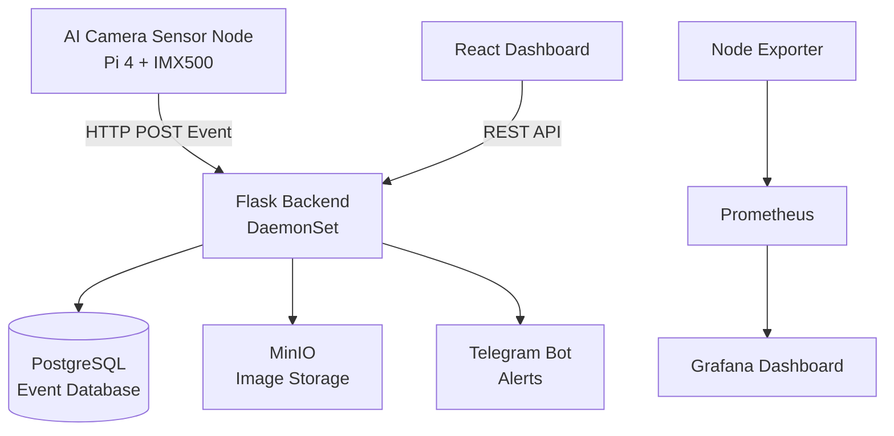
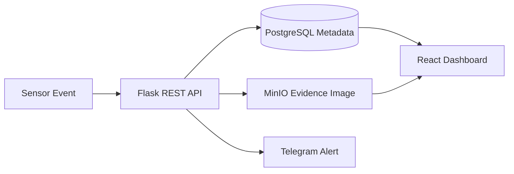
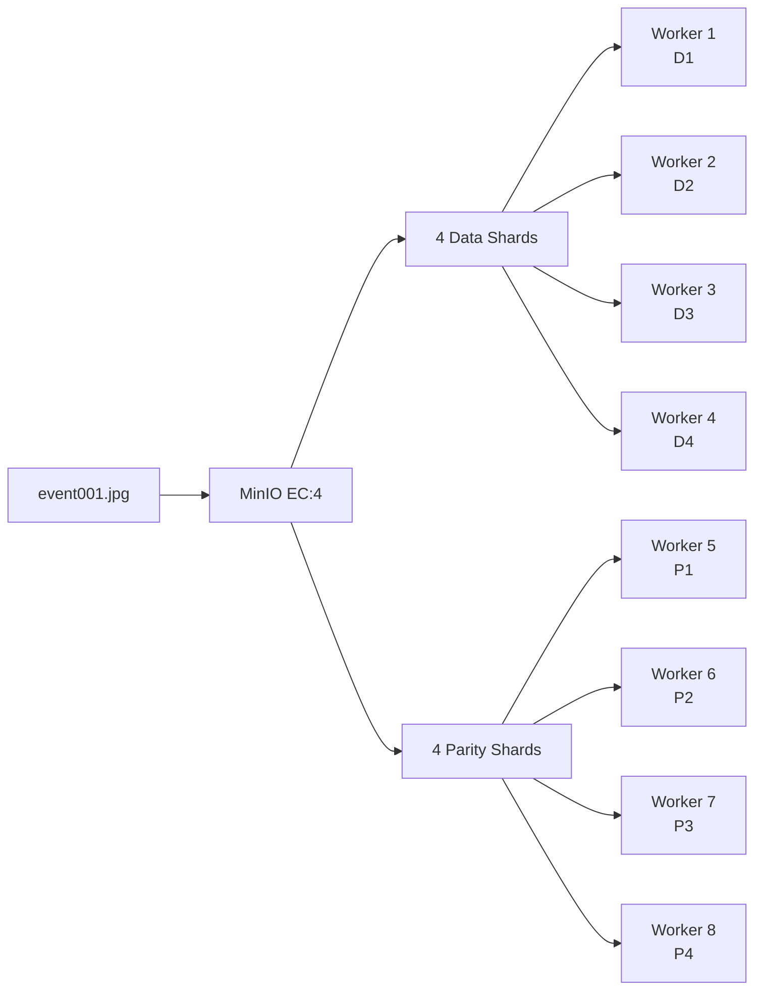
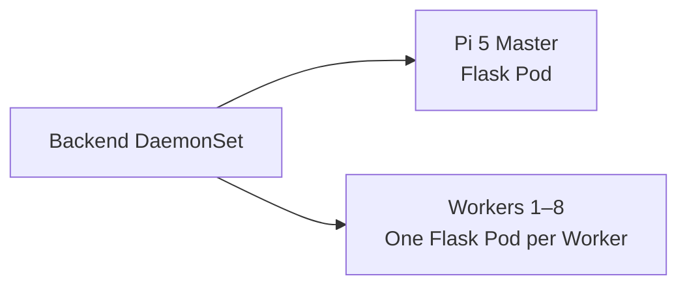
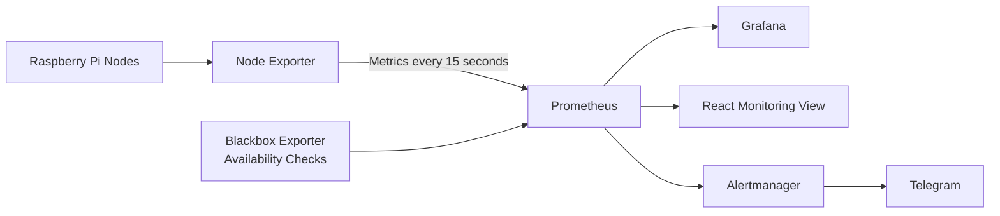
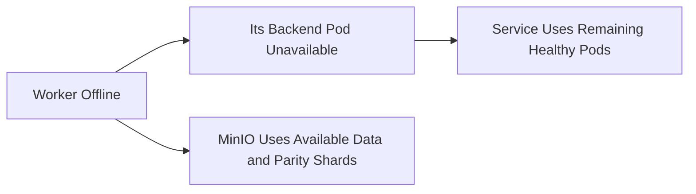

# Task 7 — Backend Deployment with Distributed Storage

## Overview

In this task, we deployed a distributed backend system on a Raspberry Pi cluster using **Flask, PostgreSQL, MinIO, Docker, and k3s Kubernetes**.

The backend receives AI detection events from the sensor node, stores event information, saves evidence images, and provides APIs for the frontend dashboard.

---

# Architecture



---

# Technology Stack

| Component | Technology | Purpose |
|---|---|---|
| AI Sensor | Pi 4 + Sony IMX500 | Runs the AI model and creates detection events |
| Backend | Flask (Python) | Receives events and provides REST APIs |
| Frontend | React | Displays events, images, live camera, and node information |
| Database | PostgreSQL | Stores searchable event metadata and event status |
| Object Storage | MinIO | Stores evidence images across the worker nodes |
| Containerization | Docker | Packages the applications and their dependencies |
| Cluster Management | k3s Kubernetes | Deploys and manages services across the cluster |
| Monitoring | Node Exporter + Prometheus + Grafana | Collects and displays node performance data |

---

# System Workflow

## 1. Threat Detection

The sensor node uses a **Sony IMX500 AI camera**. The compiled model is stored as `network.rpk`, and inference runs on the IMX500 camera hardware.

When a detection passes the configured confidence threshold, OpenCV draws the bounding box, creates a JPEG snapshot, and the sensor sends the event to Flask.


A simplified part of the sensor code is:

```python
imx500 = IMX500(RPK_PATH)
requests.post(API_URL, json=event, timeout=3)
```

The event includes the sensor ID, location, threat level, detected classes, confidence scores, bounding boxes, and a Base64-encoded JPEG snapshot.

The POST request runs in a background thread so that network delays do not stop the live camera stream.

---

## 2. Backend Processing

The Flask backend receives the event through `POST /events` and performs the following steps:

1. Checks whether detection is enabled.
2. Reads the event metadata.
3. Decodes the evidence image.
4. Uploads the image to MinIO.
5. Inserts the metadata into PostgreSQL.
6. Provides the stored event to React through REST APIs.
7. Sends a Telegram alert when configured.



The frontend requests events through Flask endpoints such as:

```text
GET  /api/events
GET  /api/events/{id}
POST /api/events/{id}/status
```

---

# Data Storage

The system separates structured event information from evidence image files.

## PostgreSQL

PostgreSQL stores information such as:

```text
Event ID
Received Time
Sensor ID
Location
Threat Level
Detections and Bounding Boxes
Confidence Score
Status
MinIO Image Reference
```

The detections are stored as **JSONB**, allowing one event to contain multiple detected objects.

The event status follows this workflow:

```text
new → acknowledged → resolved
```

This allows the dashboard to filter events by date, threat type, sensor, or status.

PostgreSQL also stores the shared detection on/off setting so all Flask replicas use the same value.

### Why PostgreSQL?

- Fast searching, sorting, and filtering
- Supports multiple Flask replicas at the same time
- Supports JSONB for flexible detection data
- Reliable structured storage

---

## MinIO

MinIO stores the evidence images generated during detection.

```text
evidence/
 ├── event001.jpg
 ├── event002.jpg
 └── event003.jpg
```

Flask uploads each image using MinIO's **S3-compatible API**.

### Distributed Image Storage

MinIO runs as an **8-replica StatefulSet**, with one MinIO Pod on each worker node. The storage class is configured as **EC:4**.

For every image, MinIO creates:

- **4 data shards** containing encoded parts of the image
- **4 parity shards** containing recovery information



The parity shards are calculated recovery information, not direct copies of specific data shards. MinIO combines the available shards to reconstruct missing image data.

The main Kubernetes configuration is:

```yaml
kind: StatefulSet
spec:
  replicas: 8

- name: MINIO_STORAGE_CLASS_STANDARD
  value: "EC:4"
```

### Storage Availability

| Worker Nodes Offline | Read Existing Images | Write New Images |
|:---:|:---:|:---:|
| 0–3 | Yes | Yes |
| 4 | Yes | No |
| 5 or more | No | No |

When unavailable workers return, MinIO can synchronize and heal missing or outdated shards.

### Why MinIO?

- Suitable for image and object storage
- Distributes image data across worker nodes
- Provides fault tolerance through erasure coding
- Provides an S3-compatible API
- Lightweight enough for Raspberry Pi nodes

---

# Kubernetes Deployment

The Flask backend is deployed using a Kubernetes **DaemonSet**.

A DaemonSet ensures that one backend Pod runs on every eligible cluster node.



The relationship is:

```text
DaemonSet → Pod → Container → Flask Application
```

Docker packages Flask and its dependencies into a container image. k3s creates the Pods and runs the Flask container inside each Pod.

```yaml
kind: DaemonSet
metadata:
  name: backend

containers:
  - name: backend
    image: sentinel-backend:latest
```

### DaemonSet and Kubernetes Service

The DaemonSet creates and maintains the Pods. It does **not** load-balance requests.

The Kubernetes Service provides a stable endpoint and routes API traffic to healthy backend Pods.


The sensor sends events to the master node on port `8080`, where the Flask Pod is exposed through `hostPort`.

Kubernetes checks every backend Pod through:

```text
GET /health
```

An unready Pod is removed from Service traffic, while an unhealthy container can be restarted automatically.

### Benefits

- One backend instance on every node
- Automatic deployment when a node joins
- Automatic container restart after a failure
- Remaining backend Pods continue working if a worker fails
- Requests are routed to healthy Pods

---

# Node Deployment

## Master Node (Raspberry Pi 5)

Runs:

- k3s control plane
- Traefik ingress
- PostgreSQL database
- React frontend
- Flask backend instance
- Prometheus and Grafana

---

## Worker Nodes (8 × Raspberry Pi 3)

Each worker runs:

- k3s agent
- Flask backend instance
- One MinIO storage Pod
- Persistent MinIO storage
- Node Exporter

---

# Monitoring System

The cluster is monitored using **Node Exporter, Blackbox Exporter, Prometheus, and Grafana**.



- **Node Exporter** provides CPU, RAM, disk, temperature, and network metrics.
- **Blackbox Exporter** checks node and sensor availability.
- **Prometheus** collects and stores the metrics every 15 seconds.
- **Grafana** displays the monitoring graphs.
- **React** also reads Prometheus data for the main monitoring page.
- **Alertmanager** handles infrastructure alerts.

```yaml
global:
  scrape_interval: 15s
  evaluation_interval: 15s
```

Collected information includes:

- CPU usage
- RAM usage
- Disk usage
- Temperature
- Node availability
- Sensor camera availability

---

# Failure Handling

If a worker node becomes unavailable:

- Its Flask Pod becomes unavailable.
- The remaining Flask Pods continue running.
- The Kubernetes Service routes requests to healthy Pods.
- The DaemonSet restores the Pod when the worker returns.
- MinIO continues reading and writing according to the number of available storage workers.



---

# Technology Decisions

## Why Flask?

Flask was selected because:

- It is lightweight and suitable for Raspberry Pi devices.
- It is a Python web framework and works naturally with the Python sensor application.
- It provides simple REST APIs between the sensor, frontend, and storage services.
- The backend is stateless, allowing all replicas to handle the same requests.

---

## Why PostgreSQL?

PostgreSQL was selected because:

- Event data requires structured and searchable storage.
- It supports filtering, status updates, and JSONB detections.
- Multiple backend replicas can access it simultaneously.
- It keeps shared settings consistent across replicas.

---

## Why MinIO?

MinIO was selected because:

- The project stores evidence images.
- Object storage is suitable for image files.
- Images are distributed across the worker nodes.
- Erasure coding provides fault tolerance.
- Flask can access it through an S3-compatible API.

---

## Why k3s?

k3s was selected because:

- It is a lightweight Kubernetes distribution.
- It is suitable for ARM and edge devices.
- It manages containers across Raspberry Pi nodes.
- It supports DaemonSets, StatefulSets, Services, health checks, and ingress.

---

# Final System Provides

- AI-based threat detection
- Flask REST API communication
- Distributed backend deployment
- PostgreSQL event storage
- Distributed MinIO image storage
- React web dashboard
- Cluster monitoring
- Telegram notifications
- Automated service management using Kubernetes
